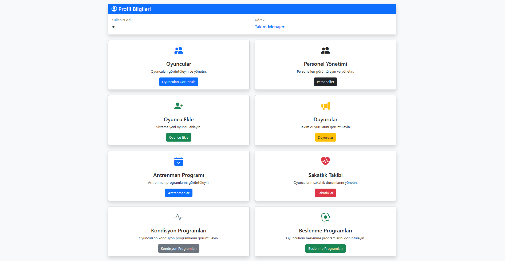
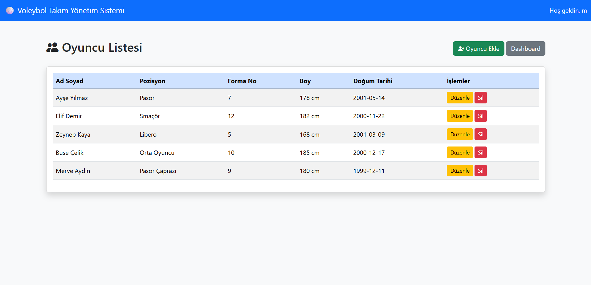

# Voleybol Takım Yönetim Sistemi

## Proje Hakkında

Bu proje, PHP, MySQL ve Bootstrap kullanılarak geliştirilmiş rol tabanlı bir Voleybol Takım Yönetim Sistemi'dir. Sistem, bir voleybol takımındaki oyuncuların ve personellerin yönetimini kolaylaştırmak amacıyla tasarlanmıştır.

Kullanıcılar sahip oldukları rollere göre farklı yetkilere sahiptir. Sistem içerisinde oyuncu yönetimi, personel yönetimi, duyuru sistemi, istatistik takibi, sakatlık yönetimi, antrenman planlaması, beslenme programları ve kondisyon programları bulunmaktadır.

## Kullanılan Teknolojiler

- PHP (Yalın PHP)
- MySQL / MariaDB
- HTML5
- Bootstrap 5
- Bootstrap Icons
- phpMyAdmin
- Session Yönetimi
- password_hash() ve password_verify()

## Kullanıcı Rolleri ve Yetkileri

### Takım Menajeri
- Oyuncu yönetimi
- Personel yönetimi
- Duyuru yönetimi
- Tüm modülleri görüntüleme

### İstatistikçi
- İstatistik ekleme
- İstatistik düzenleme
- İstatistik silme

### Fizyoterapist
- Sakatlık kaydı ekleme
- Sakatlık düzenleme
- Sakatlık silme

### Antrenör
- Antrenman programı ekleme
- Antrenman programı düzenleme
- Antrenman programı silme

### Diyetisyen
- Beslenme programı ekleme
- Beslenme programı düzenleme
- Beslenme programı silme

### Kondisyoner
- Kondisyon programı ekleme
- Kondisyon programı düzenleme
- Kondisyon programı silme

## Proje Özellikleri

- Kullanıcı kayıt sistemi
- Şifreli giriş sistemi
- Session tabanlı oturum yönetimi
- Rol tabanlı yetkilendirme
- CRUD işlemleri (Create, Read, Update, Delete)
- Modern Bootstrap arayüzü

## Kurulum

1. Proje dosyalarını indirin.
2. Veritabanını phpMyAdmin üzerinden içe aktarın.
3. `config/db.php` dosyasındaki veritabanı bilgilerini düzenleyin.
4. Projeyi Apache destekleyen bir sunucuda çalıştırın.
5. Sisteme giriş yaparak kullanmaya başlayın.

## Ekran Görüntüleri

### Dashboard

---

### Oyuncu Yönetimi

## Tanıtım Videosu

Video bağlantısı:

(Buraya Youtube veya Google Drive bağlantısı eklenecektir.)

